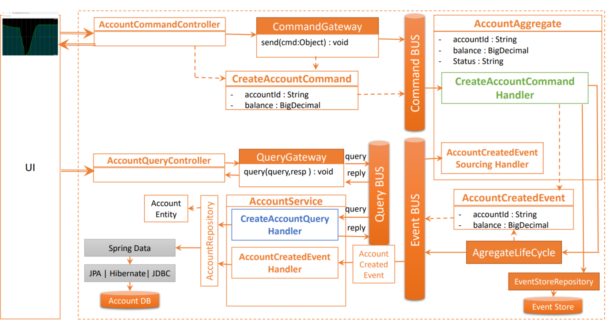
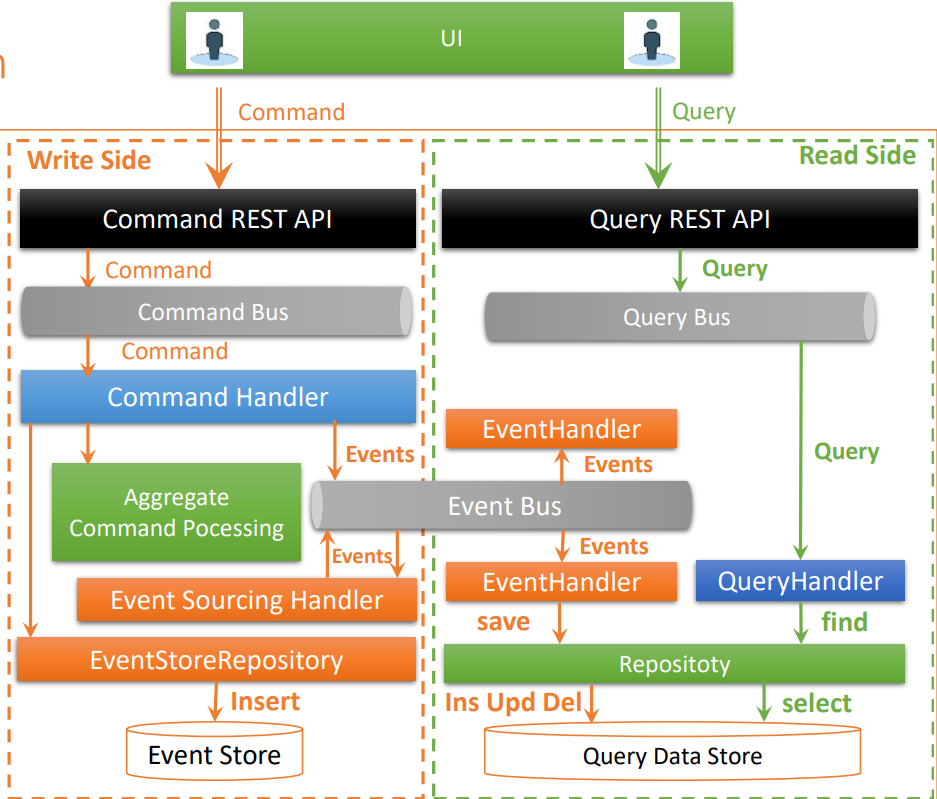
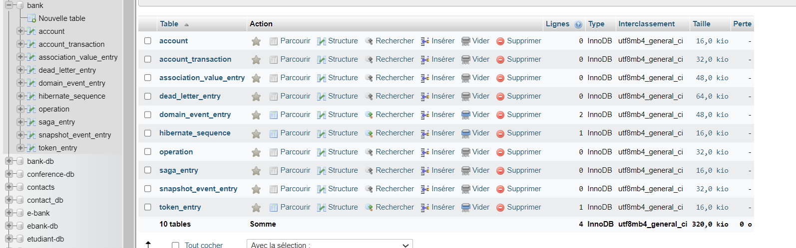
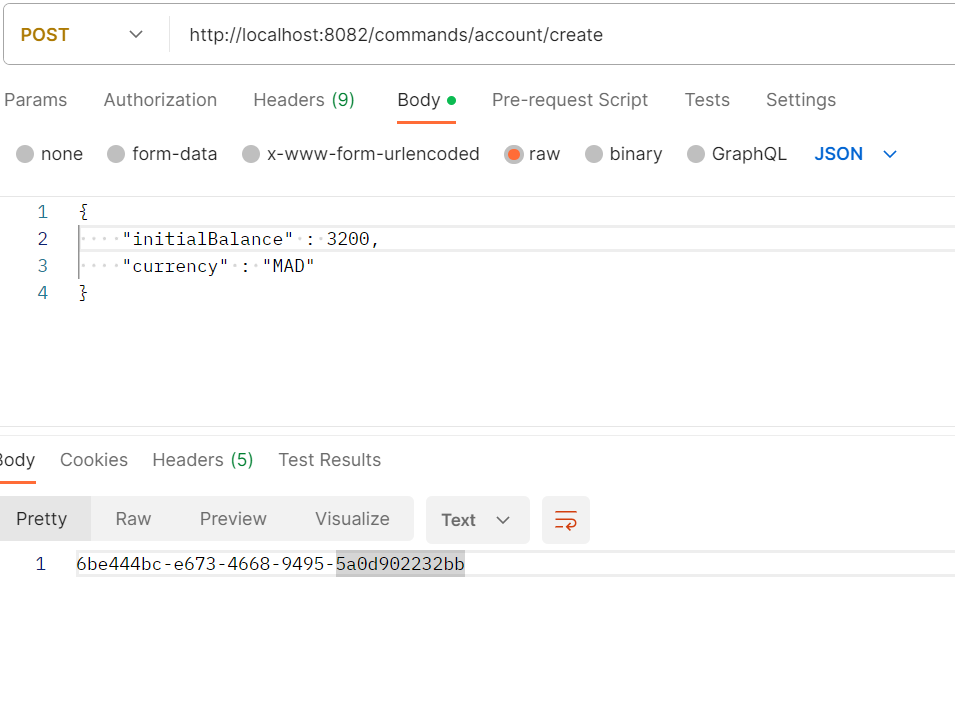
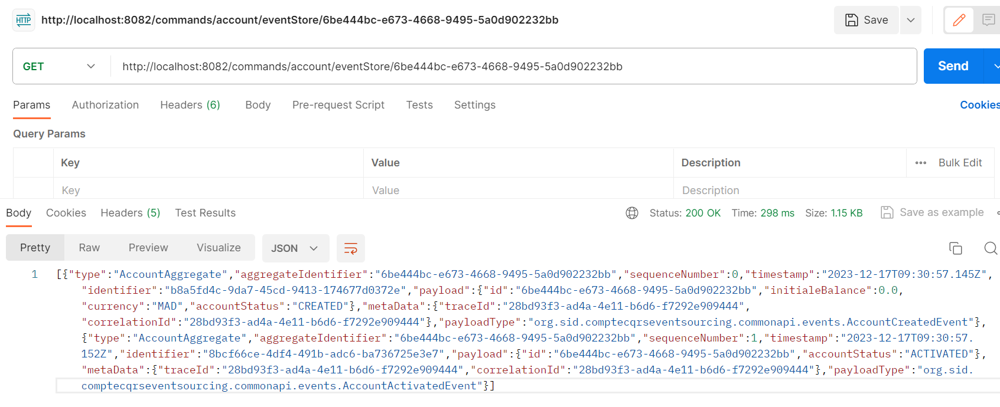
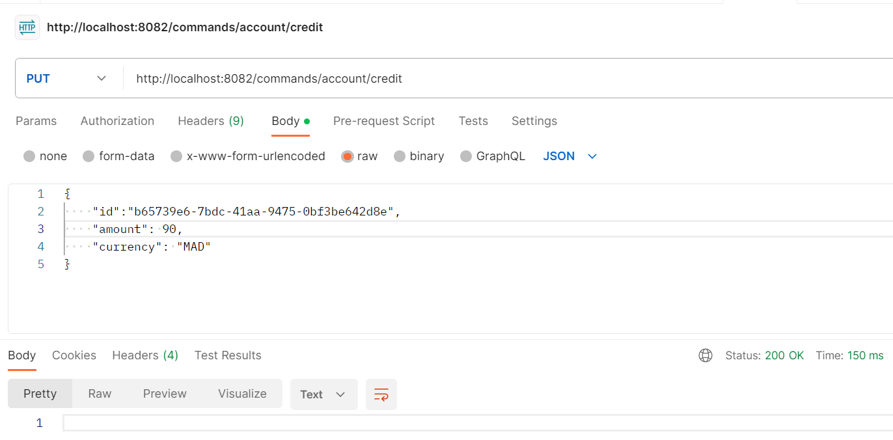
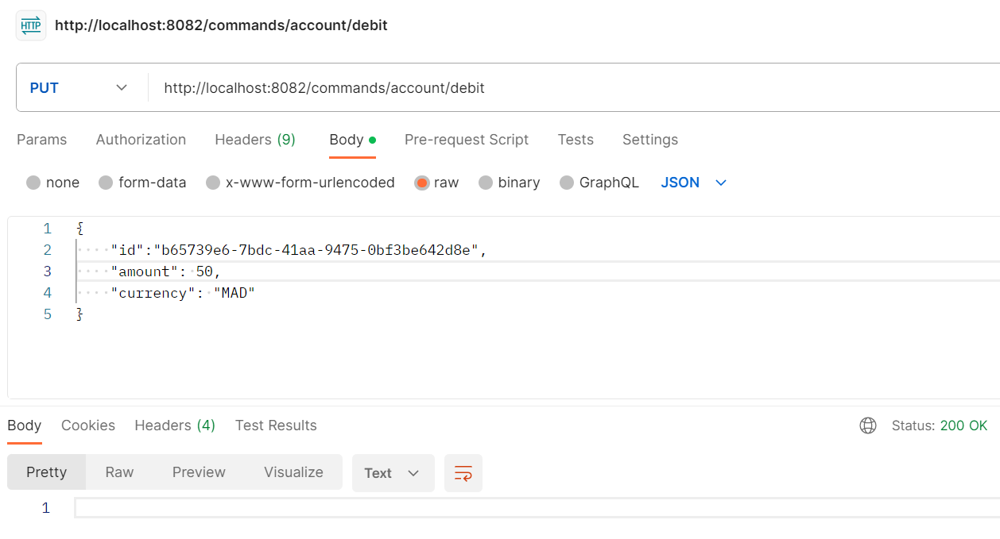
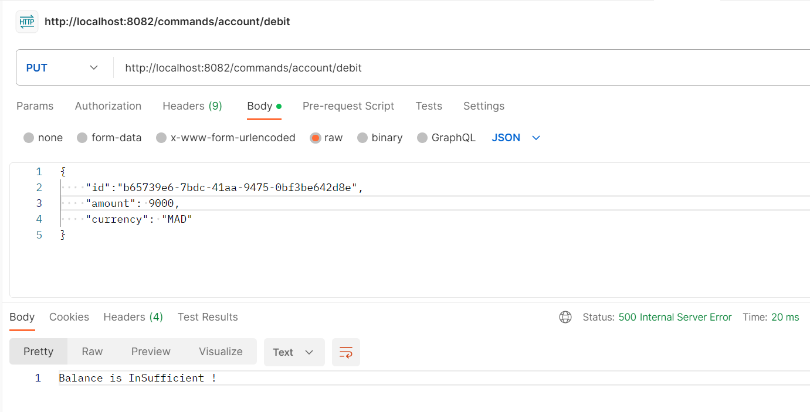
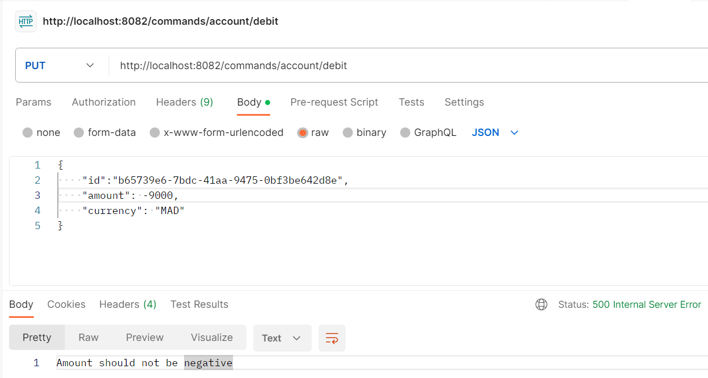

# Event Driven Architecture CQRS and Event Sourcing
| Création d'une application qui permet de gérer des comptes respectant les patterns CQRS et Event Sourcing avec les Framework AXON et Spring Boot 

**Axon**
|Axon est un framework open-source écrit en Java qui simplifie le développement de systèmes basés sur l'architecture CQRS (Command Query Responsibility Segregation) et le modèle de programmation axé sur les événements.

**CQRS (Command Query Responsibility Segregation)**
|CQRS est un modèle d'architecture logicielle qui sépare la partie lecture des données (queries) de la partie écriture (commands). Cela signifie que les opérations de lecture et d'écriture utilisent des modèles de conception différents, peuvent être mis à l'échelle indépendamment et peuvent être déployés sur des serveurs différents.

**Event Sourcing**
|Event Sourcing est un modèle de conception qui consiste à stocker les modifications apportées à l'état d'une entité en tant qu'événements. Au lieu de mettre à jour directement l'état d'une entité, une nouvelle version de l'entité est créée avec les modifications apportées à l'état et l'événement correspondant est stocké dans un magasin d'événements. L'état actuel d'une entité peut être reconstruit en jouant tous les événements dans l'ordre dans lequel ils ont été stockés.


## Architecture 
	
<p align="center">
  
</p>

<p align="center">
  
</p>

## Base Command
	
```java!
public abstract class BaseCommand <T> {
    @TargetAggregateIdentifier
    @Getter private T id;

    public BaseCommand(T id) {
        this.id = id;
    }
}
```
## Create Account Command

```java!

public class CreateAccountCommand extends BaseCommand<String>{

    @Getter private double initialeBalance;
    @Getter private  String currency;
    public CreateAccountCommand(String id, double initialeBalance, String currency) {
        super(id);
        this.initialeBalance = initialeBalance;
        this.currency = currency;
    }
}
```
	
## Credit Account Command

```java!
public class CreditAccountCommand extends BaseCommand<String>{

    @Getter private double amount;
    @Getter private  String currency;
    public CreditAccountCommand(String id, double amount, String currency) {
        super(id);
        this.amount = amount;
        this.currency = currency;
    }
}
```

## Debit Account Command
	
```java!
public class DebitAccountCommand extends BaseCommand<String>{

    @Getter private double amount;
    @Getter private  String currency;
    public DebitAccountCommand(String id, double amount, String currency) {
        super(id);
        this.amount = amount;
        this.currency = currency;
    }
}
```

## Classe Account

```java!
@Entity
@Data
@AllArgsConstructor
@NoArgsConstructor
@Builder
public class Account {
    @Id
    private String id;
    private double balance;
    private Instant createdAt;
    private String currency;
    @Enumerated(EnumType.STRING)
    private AccountStatus accountStatus;
    @OneToMany(mappedBy = "account")
    private Collection<AccountTransaction> transactions;
}
```
	
## Classe Account Transaction
```java!
@Entity
@AllArgsConstructor
@NoArgsConstructor
@Data
@Builder
public class AccountTransaction {
    @Id @GeneratedValue(strategy = GenerationType.IDENTITY)
    private Long id;
    private Date timestamp;
    private double amount;
    @Enumerated(EnumType.STRING)
    private TransactionType transactionType;
    @ManyToOne
    @JsonProperty(access = JsonProperty.Access.WRITE_ONLY)
    private Account account;

}
```

## **Les tables de la base de données**

<p align="center">
  
</p>


## **Créer un compte**
 
<p align="center">
  
</p>

## **Consulter les opérations d’un compte**

<p align="center">
  
</p>

## **Créditer un comte**

<p align="center">
  
</p>

## **Débiter un compte**

<p align="center">
  
</p>
	
<p align="center">
  
</p>

<p align="center">
  
</p>


